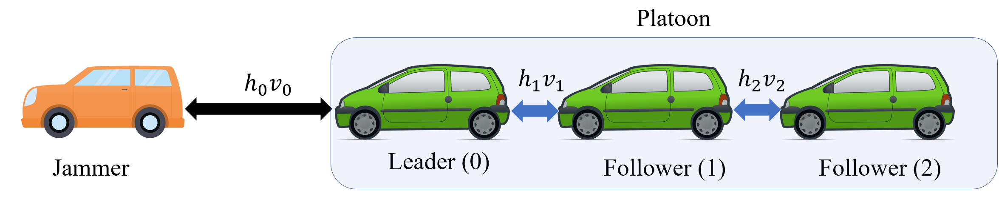
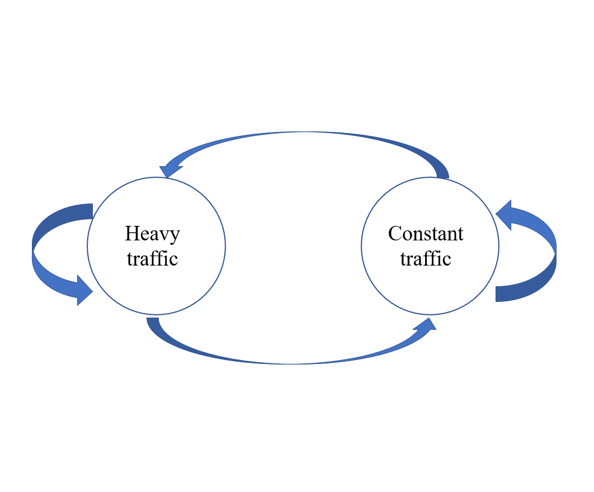

# vehicle_platoon_gym: One dimension vehicle platoon environment compatible with gym for RL

Gym environments two simulate one dimensional platoon problems with a stochastic jammer in front of the platoon. 
The environments follow the standard [gym's API](https://github.com/openai/gym).

For an example usage of this environment, see [Reducing fuel consumption in platooning systems through reinforcement learning](https://www.sciencedirect.com/science/article/pii/S2405896322010266).

## Environment

A unidimensional platoon vehicle. Agent should learn how to switch between different paramenters of an Adaptive
Cruise Control to increase fuel efficiency. 
From [Cunha, Rafael F., et al. "Reducing fuel consumption in platooning systems through reinforcement learning." IFAC-PapersOnLine 55.15 (2022): 99-104.](https://www.sciencedirect.com/science/article/pii/S2405896322010266).

`vehicle-platoon-gym` <br>



[comment]: <>  ()

[comment]: <> ()

## Installation

1. Setup a conda environment
```bash
conda create -n env_name python=3.8
conda activate env_name
```

2. Clone this git repo in an appropriate folder
```bash
git clone https://github.com/rafaelcunha2013/vehicle-platoon-gym.git
```
3. Enter the repo root folder and install the required packages:
```bash
pip install -r requirements.txt
pip install -e
```
4. Install our environment ```vehicle-platoon-gym```
```bash
pip install vehicle-platoon-gym
```

Alternatively, you can install the newest unreleased version:
```bash
git clone https://github.com/rafaelcunha2013/vehicle-platoon-gym.git
cd vehicle-platoon-gym
pip install -e .
```

## Usage

An example code is provided inside ```main.py```. To simply run with default parameters:

```bash
python main.py
```
<!---
```python
from Jammer import MyJammer
from Platooning import Platooning
import platform
import matplotlib.pyplot as plt


system = platform.system()
w_const = 80 / 3.6
w_agg_max = 80 / 3.6
w_aggre_min = 30 / 3.6
w_max = 83 / 3.6
length = 30000
th_int = 0.1
exp_dist = [40 * 200, 20 * 200]
episodes = 10
jammer = MyJammer(wvelo_const=w_const,
                  wvelo_aggre_max=w_agg_max,
                  wvelo_aggre_min=w_aggre_min,
                  wvelo_max=w_max,
                  th_int=th_int)
jammer.jammer_episodes(episodes, length, exp_dist=exp_dist)


delta = 5000
h = [[3, 3, 3], [3, 0.4, 0.4]]
Ddes = [1, 1]
position = [129, 20, 10, 0]
cd = 0.6
m = 20 * 1000
alpha_step = 1000
h_len = 1
area = 10.26
fixed_time = 100
rwd_const = 1.5
rwd_mult = 5
rwd_hc_weight = 1 / 5000
env = Platooning(jammer,
                 system=system,
                 num_states=6,
                 model_type='ACC',
                 stop_type='time_limit',
                 fixed_time=fixed_time,
                 reward_type='inst_delta_distance_per_fuel',
                 inst_delta=delta,
                 h=h,
                 Ddes=Ddes,
                 position=position,
                 cd=cd,
                 m=m,
                 alpha_step=alpha_step,
                 h_len=h_len,
                 area=area,
                 rwd_const=rwd_const,
                 rwd_mult=rwd_mult,
                 rwd_hc_weight=rwd_hc_weight)

num_episodes = 4
for episode in range(num_episodes):
    reward_history = []
    state = env.reset()
    done = False
    i = 0
    while not done:
        i += 1
        if i < 10:
            action = 1
        elif i < 20:
            action = 0
        else:
            action = 1

        next_state, reward, done, info = env.step(action)
        reward_history.append(reward)
    plt.plot(reward_history)
    plt.title("Reward (Normalized dist/fuel)")
    plt.show()
```
-->


## Citing

If you find the codes or paper useful for your research, please cite our paper:

```bibtex
@article{cunha2022reducing,
  title={Reducing fuel consumption in platooning systems through reinforcement learning},
  author={Cunha, Rafael F and Gon{\c{c}}alves, Tiago R and Varma, Vineeth S and Elayoubi, Salah E and Cao, Ming},
  journal={IFAC-PapersOnLine},
  volume={55},
  number={15},
  pages={99--104},
  year={2022},
  publisher={Elsevier}
}
```

## Acknowledgments

* [Tiago ROCHA GONÇALVES](https://tiagorochag.github.io/), who worked with me on the construction of this environment.
